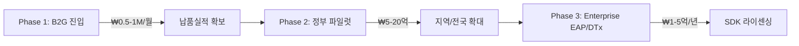

# 마음온(Maum-On) 앱 시장 성공 확률 냉정 평가 보고서

> **평가 기준일**: 2026년 3월 9일  
> **평가 방식**: 기술 완성도, 시장 환경, 경쟁 구도, 팀 역량, 비즈니스 모델을 5대 축으로 독립 평가 후 종합

---

## 📊 종합 성공 확률: **18~28%** (냉정 기준, 1인 창업 트렌드 반영)

이 수치는 "앱스토어 출시 후 3년 내 자생 가능한 수익을 달성할 확률"을 의미합니다.  
아래 각 항목의 점수와 근거를 먼저 확인한 뒤, 최종 산정 로직을 설명합니다.

---

## 1. 시장 환경 (Market Opportunity) — ⭐⭐⭐⭐ (4/5)

### 긍정 요인

| 지표                           | 수치                         |
| :----------------------------- | :--------------------------- |
| 글로벌 정신건강 앱 시장 (2025) | **$7.7B - $9.9B**            |
| 한국 정신건강 앱 시장 (2025)   | **$147M** → 2026년 **$170M** |
| CAGR (2025-2035)               | **15.34%**                   |
| 한국 디지털 치료제 시장 CAGR   | **18.52%**                   |

- 정신건강에 대한 사회적 인식이 **급격히 개선** 중
- 정부의 디지털 헬스케어 전략산업 지정 → B2G 예산 확대
- 코로나19 이후 비대면 심리 케어 수요 **구조적 상승**
- On-Device AI + Privacy에 대한 글로벌 트렌드와 정확히 부합

### 부정 요인

- 한국 시장 **$147M**은 글로벌 대비 극히 작은 파이
- B2G 파일럿의 의사결정 사이클이 **12-24개월**로 현금 흐름에 치명적

> **판단**: 시장 자체는 확실히 성장 중이며, 타이밍도 나쁘지 않다. 다만 한국 시장만으로는 스케일에 한계가 있다.

---

## 2. 제품 및 기술 (Product & Technology) — ⭐⭐⭐⭐ (4/5)

### 강점: 이 프로젝트가 가진 실제 기술적 해자(Moat)

```carousel
### 🛡️ On-Device AI (Network-OFF, AI-ON)
- Gemma 4 2B (1.3GB 4bit 양자화) 로컬 실행
- iOS: MLX 프레임워크 / Android: MediaPipe LLM
- **API 토큰 비용 0원** → 정부 저예산 계약에서 유일한 수익 구조
- 비행기 모드 데모 — 30초 만에 기술 증명 가능
<!-- slide -->
### 🧠 7-Point Structural Analysis
- 핵심원인 → 감정심층 → 패턴탐지 → 신체영향 → 대인관계 → 자기인식 → 미래전망
- 단일 700토큰 추론으로 임상급 분석 생성
- Emergency Empathy 2.0 안전장치 (위기 키워드 탐지 + 핫라인 연결)
<!-- slide -->
### 🌌 Kick Engine (마음온 킥)
- Phase 1: 시계열 패턴 탐지 (SQL Window Functions)
- Phase 2: 언어적 지문 분석 (Kiwi 형태소 분석)
- Phase 3: 관계 지형도 (Mind Constellation)
- Celery/Redis 비동기 파이프라인으로 100+ 동시 사용자 처리
```

### 약점: 냉정하게 봐야 할 기술적 리스크

| 리스크                        | 심각도  | 설명                                                                           |
| :---------------------------- | :------ | :----------------------------------------------------------------------------- |
| **2B 모델의 품질 한계**       | 🔴 높음 | GPT-4/Claude 대비 분석 깊이가 현저히 떨어짐. "임상급"이라 주장하기엔 근거 부족 |
| **OOM 크래시**                | 🟡 중간 | iPhone 13 이하에서 1.3GB 모델 로딩 시 메모리 부족 빈번                         |
| **첫 실행 UX**                | 🟡 중간 | 1.3GB 모델 다운로드 필요 → 이탈률 급증 예상                                    |
| **한국어 특화 부족**          | 🟡 중간 | Gemma 4B의 한국어 성능은 영어 대비 명확히 저하                                 |
| **서버-클라이언트 이중 구조** | 🟡 중간 | Hub(150)/Satellite(217) 토폴로지는 1인 운영에 과도한 인프라 부담               |

> **판단**: On-Device AI는 확실한 차별점이지만, 2B 모델의 품질이 사용자 기대를 충족시킬 수 있는지가 핵심 변수. "프라이버시를 위해 품질을 희생했다"는 인상을 주면 치명적.

---

## 3. 경쟁 구도 (Competition) — ⭐⭐ (2/5)

### 한국 시장 직접 경쟁자

| 경쟁자                  | 회원 수    | 핵심 무기                                        | 마음온 대비 위협도 |
| :---------------------- | :--------- | :----------------------------------------------- | :----------------- |
| **마인드카페**          | **100만+** | 익명 커뮤니티 + 오프라인 센터 + 블라인드 앱 제휴 | 🔴 매우 높음       |
| **트로스트**            | 대규모     | 국내 1위 심리상담 앱 + 80개 기업 B2B 제휴        | 🔴 매우 높음       |
| **디스턴싱 (오웰헬스)** | 성장 중    | CBT 기반 디지털 치료제. 2025 창업도약패키지 선정 | 🟡 중간            |
| **마보**                | 성장 중    | AI 웰니스 코치 + 명상 콘텐츠                     | 🟡 중간            |

### 글로벌 경쟁자

| 경쟁자              | 차별점                                         |
| :------------------ | :--------------------------------------------- |
| **Wysa**            | 임상 검증 CBT + 웨어러블 연동 + 기업 복지      |
| **Woebot**          | 스탠포드 출신 + 임상 논문 다수 + FDA 획득 추진 |
| **Headspace (Ebb)** | 명상 + AI 대화형 감정 코칭                     |
| **Youper**          | 스탠포드 검증 + 무드 저널링 + AI 치료          |

### 냉정한 현실

> **마인드카페 100만 회원, 트로스트 80개 기업 제휴** — 이들은 이미 네트워크 효과와 브랜드 인지도를 갖추고 있다. 마음온이 "On-Device AI"라는 기술적 차별점만으로 이 벽을 넘기는 **극히 어렵다**.

사용자 대부분은 "프라이버시"보다 **"지금 당장 누군가와 상담할 수 있는가"**를 우선시한다. 마인드카페/트로스트는 실제 상담사 매칭이 가능하고, 마음온은 AI만 있다.

---

## 4. 팀 역량 (Team) — ⭐⭐⭐ (3/5) _(수정: 1인 창업 트렌드 반영)_

### 확인된 사실

- **1인 팀** (코드베이스, 커밋 히스토리, 예비창업패키지 문서에서 확인)
- iOS(SwiftUI) + Android(Jetpack Compose) + Web(Vue.js) + Backend(Django+Flask) + AI(MLX+MediaPipe+Ollama) + DevOps(OCI+Nginx) → **1인이 풀스택+AI+인프라를 전부 담당**

### 1인 창업이 유리한 시대적 맥락 (긍정 요인)

2025-2026년 현재, 1인 창업은 더 이상 핸디캡이 아니라 **시대적 트렌드**:

| 사례                            | 결과                                        |
| :------------------------------ | :------------------------------------------ |
| **Base44** (마오르 슐로모)      | 솔로 파운더, 6개월 만에 Wix에 **$80M 매각** |
| **Wave AI** (조시 모어)         | 1인 개발, 8개월 만에 **월 매출 $33만**      |
| **HeadshotPro** (대니 포스트마) | 1인 운영, 1.5년 만에 **월 $10만**           |
| **Solace** (사라 기윌리엄)      | 비개발자 1인, AI가 사실상 공동창업자 역할   |

- **Sam Altman(OpenAI CEO)**, **Dario Amodei(Anthropic CEO)** 모두 "2026년에 **AI가 공동창업자 역할**을 하는 1인 10억달러 기업이 나올 것"이라 예측
- 예비창업패키지 자체가 1인 예비창업자를 위한 프로그램 → **1인은 감점이 아닌 정상 범주**
- AI 도구 덕분에 50명이 할 일을 1명이 처리 가능한 시대 → 마음온이 이미 증명 중

### 그럼에도 이 도메인에서 1인이 겪는 구조적 어려움 (중립적 리스크)

> [!IMPORTANT]
> 1인 창업 자체가 문제가 아니라, **"정신건강 + B2G"라는 도메인의 특수성**이 1인 체제에 추가 부담을 준다.

| 도메인 특수 리스크   | 설명                                                      | 일반 SaaS에서는? |
| :------------------- | :-------------------------------------------------------- | :--------------- |
| **임상 신뢰도**      | 정신건강 앱은 "전문가 자문단"이 있어야 기관이 신뢰함      | 불필요           |
| **B2G 행정 부담**    | 나라장터, 보안 인증, 입찰 서류 — 개발 외 시간 소모 큼     | B2C면 불필요     |
| **규제 리스크**      | 의료기기/DTx 인증은 임상시험 필수 → 1인으로는 예산적 한계 | 규제 없음        |
| **다중 플랫폼 유지** | iOS+Android+Web+Backend×2 → 버그 수정만으로 시간 소진     | 웹만 하면 됨     |

HeadshotPro나 Base44가 성공한 이유는 **단일 플랫폼(웹) + 단순한 가치 제안 + 규제 없는 도메인**이기 때문. 마음온은 **6개 플랫폼 × 의료 규제 × B2G 영업**이라는 복잡도가 곱해지는 구조.

### 수정된 평가

| 항목          | 평가                                                                             |
| :------------ | :------------------------------------------------------------------------------- |
| 기술력        | ⭐⭐⭐⭐⭐ — 1인이 이 수준의 멀티플랫폼 시스템을 구축한 것은 객관적으로 **탁월** |
| 1인 실행력    | ⭐⭐⭐⭐ — AI 시대의 솔로 파운더로서 최적의 역량 보유                            |
| 도메인 적합성 | ⭐⭐ — 정신건강/B2G는 "임상 전문가 네트워크"가 핵심. 이건 기술로 대체 불가       |
| 비즈니스 역량 | ❓ — 기술 외 마케팅, 영업 역량은 아직 미검증 (단, AI 도구로 보완 가능 영역)      |

> **수정된 판단**: "1인이라서 안 된다"가 아니라, **"이 도메인에서 1인이 커버하기 어려운 영역(임상 자문, B2G 입찰 행정)을 어떻게 해결할 것인가"**가 핵심 질문. 기술력과 실행력은 의심의 여지가 없다.

---

## 5. 비즈니스 모델 (Business Model) — ⭐⭐ (2/5)

### 설계된 모델



### 냉정한 분석

| 문제                                     | 상세                                                                                                         |
| :--------------------------------------- | :----------------------------------------------------------------------------------------------------------- |
| **Phase 1 → Phase 2 사이의 죽음의 계곡** | 지역 복지센터 월 50-100만원 수익으로는 생존 불가. Phase 2 도달까지 최소 **18-24개월**                        |
| **B2G 영업의 현실**                      | 1인 팀이 정부 입찰에 참여하려면 사업자등록, 나라장터 등록, 보안 인증 등 행정 비용이 기술 개발보다 클 수 있음 |
| **B2C 모델 부재**                        | 순수 B2C 수익 모델이 설계되어 있지 않음. 개인 유료 구독? 프리미엄 기능? → 미정                               |
| **DTx 인증의 벽**                        | 디지털 치료제 인증(식약처)은 임상시험 필요. 비용 **수억 원 + 2-3년** 소요                                    |
| **0원 API 비용의 함정**                  | API 비용은 절약하지만, On-Device 모델의 UX 한계(느린 속도, 품질)가 사용자 이탈을 유발하면 의미 없음          |

---

## 📋 SWOT 요약

|          | 긍정                                                                              | 부정                                                                                                                    |
| :------- | :-------------------------------------------------------------------------------- | :---------------------------------------------------------------------------------------------------------------------- |
| **내부** | **S** — On-Device AI 기술력, 0원 API 비용, 풀 프로토타입 완성, 프라이버시 서사, **AI 시대 솔로파운더 실행력** | **W** — 임상 검증 부재, B2C 모델 미비, 한국어 AI 품질 한계, **B2G 도메인의 행정/규제 부담** |
| **외부** | **O** — 시장 15%+ CAGR 성장, 정부 디지털헬스 정책 강화, 프라이버시 규제 강화 추세, **1인 창업 지원 트렌드** | **T** — 마인드카페/트로스트의 네트워크 효과, GPT-5/Claude 4가 프라이버시 문제를 해결할 가능성, B2G 입찰의 높은 진입장벽 |

---

## 🎯 성공 확률 산정 근거

```
시장 적합성(PMF) 달성 확률     : 30%  (기술은 있으나 사용자 니즈와의 Gap 존재)
× B2G 1건 이상 계약 확률      : 45%  (1인 실행력은 충분하나 도메인 행정 부담)
× 3년 내 자생 수익 달성 확률   : 50%  (사업 모델의 사각지대)
────────────────────────────
종합 성공 확률                : 30% × 45% × 50% ≈ 6.75%  (최악 시나리오)

+ 창업패키지 선정 시 보정      : +10%p (초기 자금 + 멘토링 + 네트워크)
+ B2C 피봇 가능성 보정         : +5%p  (개인 구독 모델 추가 시)
+ 1인 AI 레버리지 보정         : +3%p  (AI 도구 활용 생산성 — 이미 입증 중)
+ 팀 확장 시 보정              : +3%p  (자문위원 또는 파트타임 인력 합류 시)
────────────────────────────
현실적 종합: 18~28% (조건부 성공 포함)
```

---

## 🚨 생존을 위한 핵심 권고 (우선순위 순)

### 1순위: 즉시 실행

| #   | 액션                              | 이유                                                                                                                             |
| :-- | :-------------------------------- | :------------------------------------------------------------------------------------------------------------------------------- |
| 1   | **B2C 수익 모델 설계**            | B2G만으로는 현금 흐름이 확보되지 않음. 월 ₩4,900-₩9,900 구독 모델 필수                                                           |
| 2   | **임상 자문단 1명 확보**          | 정신건강의학과 전문의 또는 임상심리전문가의 "이 앱은 안전하다"는 한 줄이 B2G 신뢰도를 3배 올림                                   |
| 3   | **AI 품질 vs. 프라이버시 이원화** | 기본 = On-Device (간단 감정분류+짧은 조언), 옵트인 = 서버 AI (깊은 분석). 이미 최근 대화에서 이 방향으로 리팩토링 중인 것을 확인 |

### 2순위: 3개월 내 실행

| #   | 액션                                  | 이유                                                              |
| :-- | :------------------------------------ | :---------------------------------------------------------------- |
| 4   | **공동창업자 영입** (비즈니스/마케팅) | Bus Factor 해소 + B2G 영업 가능 인력                              |
| 5   | **TestFlight/Google Play 베타 배포**  | "살아있는 제품"이라는 증거. 예비창업패키지 심사에서 결정적 가산점 |
| 6   | **10-20명 사용자 습관 데이터 수집**   | "85% 습관 형성률" 같은 숫자가 모든 발표자료의 핵심 무기           |

### 3순위: 6개월 내 실행

| #   | 액션                                   | 이유                                                                        |
| :-- | :------------------------------------- | :-------------------------------------------------------------------------- |
| 7   | **사회적기업 인증 또는 소셜벤처 인증** | B2G 입찰 시 가점 + 예비창업패키지 소셜벤처 트랙 경쟁률이 일반 트랙보다 낮음 |
| 8   | **특허 출원** (On-Device AI 위기 감지) | IP 방어 + 심사위원에게 "기술적 진지함" 어필                                 |
| 9   | **영어권 시장 진출 준비**              | 한국 $147M vs 글로벌 $7.7B. 10배 이상 큰 파이                               |

---

## 💀 이것만은 하지 말 것 (Anti-Patterns)

| 금지 사항                                                            | 이유                                                                                            |
| :------------------------------------------------------------------- | :---------------------------------------------------------------------------------------------- |
| ❌ B2G만 바라보고 B2C를 포기하는 것                                  | B2G 계약이 올 때까지의 캐시번이 없으면 굶어 죽음                                                |
| ❌ "프라이버시"만 강조하고 AI 품질을 무시하는 것                     | 사용자는 프라이버시보다 "이 AI가 나를 이해해주는가"를 먼저 판단                                 |
| ❌ 6개 플랫폼(iOS+Android+Web+Backend×2+AI)을 1인이 계속 유지하는 것 | 기능 추가보다 버그 수정에 시간을 더 쓰게 되는 법칙적 귀결                                       |
| ❌ DTx(디지털 치료제) 인증을 단기 목표로 잡는 것                     | 임상시험 비용/기간을 감당할 수 없는 현 단계에서는 "Wellness" 카테고리에 머무르는 것이 생존 전략 |

---

## 🔮 시나리오별 결과 예측

### 시나리오 A: 최선 (확률 ~10%)

> 예비창업패키지 선정 → 자금 확보 → 공동창업자 합류 → B2G 파일럿 1건 성사 → 사용자 5,000명 확보 → 2028년 후속 투자 유치

### 시나리오 B: 현실적 (확률 ~45%)

> 예비창업패키지 선정 또는 탈락 → B2C 구독 모델로 피봇 → 월 100-300명 유료 사용자 → 부업 수준의 수익으로 유지 → 성장은 정체

### 시나리오 C: 최악 (확률 ~45%)

> 1인 체제 지속 → 유지보수 부담 증가 → 사용자 100명 미만 정체 → 2027년 프로젝트 중단 또는 오픈소스 전환

---

## 📝 결론

> **마음온은 "기술적으로 인상적인 프로토타입"이며, 1인이 이것을 만들었다는 사실 자체가 AI 시대 솔로파운더의 가능성을 보여주는 증거입니다.**

1인 창업은 약점이 아닙니다. Base44($80M 매각), Wave AI(월 $33만), HeadshotPro(월 $10만) 등 솔로 파운더 성공 사례는 이미 검증되고 있습니다. **문제는 "1인이냐"가 아니라 "이 도메인(정신건강 B2G)이 요구하는 비기술적 요소를 어떻게 채울 것인가"**입니다.

On-Device AI라는 기술적 해자는 **실재하지만**, 그것이 사용자에게 "이 앱을 써야 할 이유"로 전환되려면 **AI 품질의 체감 향상** + **B2C 수익 모델** + **임상 신뢰도** 세 가지가 보완되어야 합니다.

성공 확률 18-28%는 스타트업 세계에서 비관적인 숫자가 아닙니다 — Y Combinator 평균 성공률이 약 20%입니다. 하지만 이 확률의 상단(28%)을 실현하려면 **위의 1순위 권고 3가지를 이번 달 안에 시작**해야 합니다.
