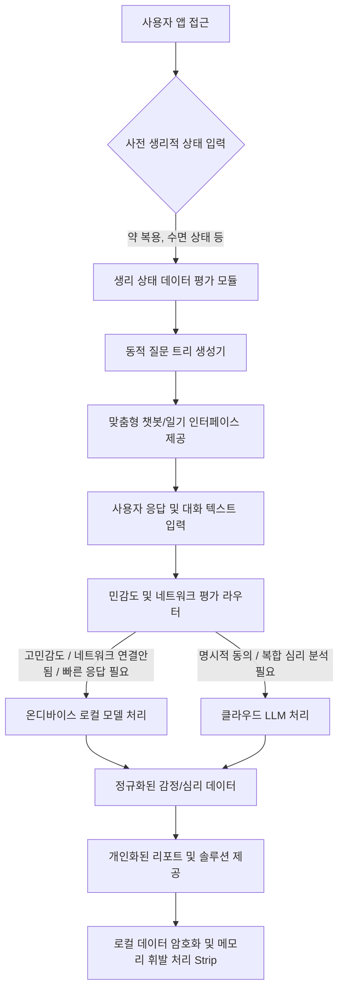

# 특허 명세서 초안 (Draft)

## 1. 발명의 명칭

**국문:** 생리적 상태 입력에 기반한 동적 질문 트리 재배열 및 개인정보 민감도에 따른 온디바이스-클라우드 하이브리드 AI 심리 케어 제공 시스템 및 그 제어 방법
**영문:** Hybrid On-Device and Cloud AI Psychological Care System and Control Method Based on Dynamic Question Tree Rearrangement According to Physiological States Input

## 2. 발명의 속하는 기술 및 분야

본 발명은 인공지능(AI) 기반의 사용자 맞춤형 심리 진단 및 케어 시스템에 관한 것으로, 더욱 상세하게는 사용자의 수면 상태 및 약물 복용 여부와 같은 생리적/물리적 상태 데이터를 우선 수집하여 심리 평가를 위한 질문 트리를 동적으로 재조합(배열)하고, 수집되는 데이터의 민감도와 네트워크 상태에 따라 온디바이스(On-device) 로컬 AI 모델과 클라우드(Cloud) 기반 대형 AI 모델을 하이브리드 형태로 가변 라우팅하여 프라이버시를 극대화하는 심리 케어 시스템 및 그 방법에 관한 것이다.

## 3. 발명의 배경이 되는 기술 (기존 기술의 문제점)

1. **정적이고 획일화된 심리 진단 플로우의 한계:** 기존의 심리 검사 챗봇이나 일기 앱은 사용자의 그날그날의 생물학적/물리적 상태(수면 부족, 약물 복용)를 고려하지 않고 정해진 순서대로 감정이나 사건만을 묻는다. 우울감의 원인이 수면 부족과 같은 신체적 원인에서 기인했음에도 이를 감별하지 못해 AI의 심리 진단 결과에 심각한 오류가 발생하는 문제점이 있다.
2. **클라우드 의존성 및 개인정보 유출 우려:** 대부분의 AI 심리 상담 서비스는 클라우드 기반의 대형언어모델(LLM)에 의존하고 있다. 이는 사용자의 지극히 개인적이고 민감한 정신 건강 데이터가 네트워크를 타고 외부 서버로 전송됨을 의미하며, 데이터 유출에 대한 불안감으로 인해 사용자가 솔직한 감정 기록을 꺼리게 만드는 심리적 진입 장벽을 생성한다.

## 4. 발명이 해결하고자 하는 과제 (목적)

1. 사용자의 신체 및 생리적 상태(수면, 약물 복용 등)를 심리적, 감정적 사건보다 선행하여 파악하고, 그 결과에 따라 후속 AI 질문(사건, 감정, 생각 추출 등)의 내용과 순서를 실시간으로 동적 재배열함으로써, 신체적 요인과 심리적 요인을 분리/결합하여 정확한 다차원 감정 분석을 수행하는 것이다.
2. 사용자의 대화 기록 및 일기 데이터를 실시간으로 평가하여, 일상적/일반적이거나 프라이버시 민감도가 매우 높은 데이터는 기기 내부의 '온디바이스 AI'에서 오프라인으로 1차 처리하고, 심층 분석이 필요하거나 사용자가 클라우드 분석에 명시적으로 동의한 경우에만 '클라우드 AI'로 비동기 전송하는 하이브리드 동적 라우팅 시스템을 구현하여 보안성과 응답성을 동시에 극대화하는 것이다.

## 5. 발명의 구성 (핵심 메커니즘)

### 5.1 시스템 아키텍처 및 흐름도

### 5.2 핵심 구성 요소

1. **생리 상태 선행 평가 모듈:** 사용자가 앱에서 대화 또는 일기를 작성하기 전, 팝업 또는 1차 질문을 통해 [수면의 질], [관련 약물 복용 여부 및 시간]을 입력받는 모듈.
2. **동적 질문 트리 생성기:** 생리 상태 모듈로부터 받은 인풋 값을 바탕으로, 이후 전개될 '사건, 감정, 인지, 셀프톡' 등의 질문 가중치와 순서를 조립하는 모듈. (예: 수면이 극도로 부족한 경우 "오늘은 수면 부족으로 감정이 더 예민할 수 있어요. 오늘 가장 자극이 되었던 사건은 무엇인가요?" 등 상황 인지적 질문 배정)
3. **하이브리드 동적 모델 라우터:** 입력된 텍스트를 파싱하여, 자해/자살 암시 등의 초민감 정보나 일반 일상 대화로 판별되면 기기 내의 경량화된 AI(온디바이스 LLM)를 통해 오프라인으로 즉각 응답 및 분석을 수행하고, 사용자가 '심리 전문가 분석 리포트'를 요청한 경우에만 익명화 처리 후 클라우드 서버(대형 LLM)로 전송하는 분기(Switching) 제어 모듈.

## 6. 발명의 효과

1. **진단 정확도 향상:** 심리 상태와 신체 상태의 교란 변수(예: 약효 지연, 수면 부족)를 분리하여 분석함으로써 AI가 도출해내는 심리 진단의 임상적 정확도를 획일적 질문 대비 기하급수적으로 향상시킬 수 있다.
2. **절대적 프라이버시 보증 (마케팅 및 확장성):** 철저한 오프라인 온디바이스 처리와 네트워크 단절 상태에서도 작동하는 AI 시스템을 통해, 정신 건강 데이터를 서버에 남기고 싶지 않아 하는 사용자층의 기피 현상을 근본적으로 해소하고 '가장 안전한 심리 케어 플랫폼'이라는 독보적 포지셔닝이 가능하다.
3. **서버 운영 비용(LLM API Cost) 절감:** 모든 입력 데이터를 유료 클라우드 LLM API로 전송하지 않고, 일상적 대화의 70~80%를 온디바이스 모델로 오프로드(Offload)함으로써 유지보수 및 서버 비용을 극단적으로 최소화할 수 있다.

## 7. 청구 범위 (청구항 초안)

- **[청구항 1] (독립항)**
  사용자 단말기에서 실행되는 AI 기반 심리 케어 제공 방법에 있어서,
  (a) 상기 사용자 단말기에 위치한 사전 평가 모듈이 사용자의 수면 상태 및 약물 복용 여부를 포함하는 생리적/물리적 상태 데이터를 우선적으로 입력받는 단계;
  (b) 동적 질문 생성 모듈이 상기 입력받은 생리적/물리적 상태 데이터에 대응하여, 후속 심리 평가를 위한 사건, 감정, 생각 조회의 질문 순서 및 내용을 동적으로 재배열하여 맞춤형 질문 트리를 생성하는 단계;
  (c) 상기 생성된 질문 트리에 따른 사용자의 응답 텍스트를 수신하는 단계;
  (d) 라우팅 제어 모듈이 상기 수신된 응답 텍스트의 개인정보 민감도, 사용자의 명시적 동의 여부, 및 현재 네트워크 상태 중 적어도 하나를 기준값으로 평가하여, 분석 주체를 사용자 단말기 내의 '온디바이스 로컬 모델' 또는 외부 서버의 '클라우드 모델' 중 하나로 동적 할당(라우팅)하는 단계; 및
  (e) 상기 할당된 모델을 통해 분석된 심리 결과 리포트를 사용자 단말기 화면에 출력하는 단계를 포함하는 것을 특징으로 하는 심리 케어 제공 방법.

- **[청구항 2] (종속항)**
  제 1항에 있어서, 상기 (d) 단계의 라우팅 제어 모듈은,
  상기 사용자의 네트워크가 단절되어 있거나, 상기 응답 텍스트를 키워드 분석한 결과 특정 임계치 이상의 민감성(Private) 수치를 갖는 것으로 판단된 경우, 외부 서버로의 데이터 전송을 차단하고 상기 사용자 단말기 내의 '온디바이스 로컬 모델'만을 이용하여 심리 진단 및 대화 응답 처리를 수행하는 것을 특징으로 하는 심리 케어 제공 방법.

- **[청구항 3] (종속항)**
  제 1항에 있어서,
  상기 (b) 단계의 동적 질문 생성 모듈은,
  상기 수집된 수면 상태 데이터가 기 설정된 양호 기준에 미달하거나 특정 심리 치료 약물의 복용이 확인된 경우, 심리적 왜곡 판단 가중치를 보정하기 위해 감정 촉발 원인을 물리적 상태와 연관 지어 질문하는 우회 질의를 상기 질문 트리의 최우선 순위로 재배치하는 것을 특징으로 하는 심리 케어 제공 방법.
